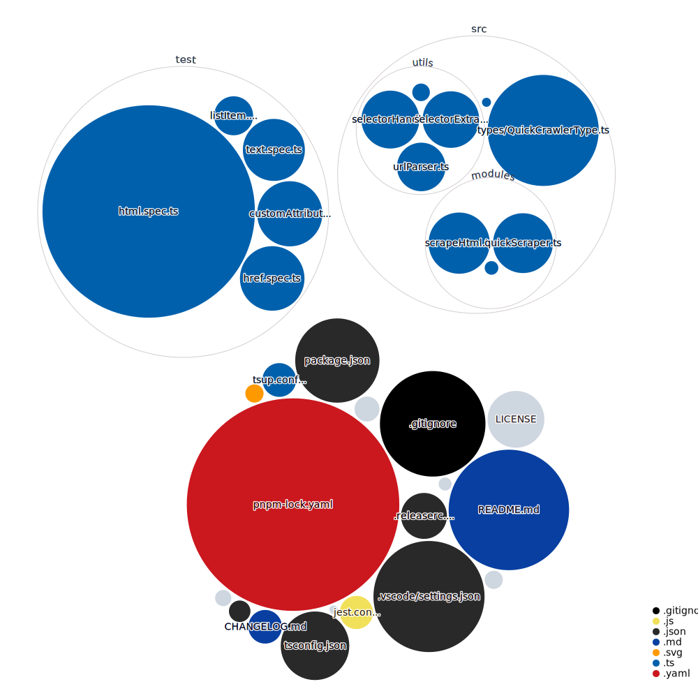

# Quick Scraper


An easy, lightweight scraper built using typescript for good developer experience.


## Features.

- If it works in cheerio, it will work here.
- Automatically change any encoding to UTF-8.
- Built on typescript.
- Great editor support.

### Cons.
- It doesn't play well with nested structures like
```html
  <p>
    abcd
    <a href='abcd'>Some Url</a>
  </p>
```
In this case, if you want to select the text `abcd`, it won't work ootb as there are some limitiations in the way jquery does it directly, to handle such cases, use the raw output object and then apply the logic in there.

## Installation

Yarn

```sh
yarn add quick-scraper
```

NPM

```sh
npm i quick-scraper
```

## Usage

```ts
import { quickScraper } from "quick-scraper"

await quickScraper({
  url: "https://typestrong.org/ts-node/",
  options: {
    title: {
      // This property can be changed to the name you want.
      selector: ".hero__subtitle",
    },
    docs: {
      selector: "a.navbar__item:nth-child(1)",
      text: false, // Text is enabled by default, so you need to disable it explicitly.
      href: true, // One of the attribute that's available by default.
    },
    releaseNotes:{
      selector: "a.navbar__item:nth-child(3)",
      text: true, // You can also enable multiple attributes at once.
      href: true,
    }
  },
});

// Output
/*

{
  raw: [Function: initialize] {}, // It's the default output from cheerio, use it as you like.
  data: {
    title: { text: 'TypeScript execution and REPL for node.js' },
    docs: { href: 'https://typestrong.org/ts-node/docs/' },
    releaseNotes: {
      text: 'Release Notes',
      href: 'https://github.com/TypeStrong/ts-node/releases'
    }
  }
}
*
/
```

### Scrape a HTML string.

```ts
// The process works similar to the quickScraper, few things needs to be changed.

import { scrapeHtml } from 'quick-scraper';

await scrapeHtml({
  html: "html source code from https://typestrong.org",
  options: {
    title: {
      // This property can be changed to the name you want.
      selector: ".hero__subtitle",
    },
    docs: {
      selector: "a.navbar__item:nth-child(1)",
      text: false, // Text is enabled by default, so you need to disable it explicitly.
      href: true, // One of the attribute that's available by default.
    },
    releaseNotes:{
      selector: "a.navbar__item:nth-child(3)",
      text: true, // You can also enable multiple attributes at once.
      href: true,
    }
  },
});

// Output
/*

{
  raw: [Function: initialize] {}, // It's the default output from cheerio, use it as you like.
  data: {
    title: { text: 'TypeScript execution and REPL for node.js' },
    docs: { href: 'https://typestrong.org/ts-node/docs/' },
    releaseNotes: {
      text: 'Release Notes',
      href: 'https://github.com/TypeStrong/ts-node/releases'
    }
  }
}
*
/
```

### More Examples.

#### Custom Attribute

```ts
await scrapeHtml({
  html: "html source code from https://typestrong.org",
  options: {
    relStatus: {
      // This property can be changed to the name you want.
      selector: "a.navbar__item:nth-child(3)",
      attrs:{
        rel: true // Key will be the identifier of the attribute you want to scrape.
      }
    },
  },
});

All custom attributes will be accessible under Attrs key inside `output.data`
// Output
/*

{
  raw: [Function: initialize] {}, // It's the default output from cheerio, use it as you like.
  data: {
    relStatus: { attrs: { rel: "noopener noreferrer" } }
  }
}
*
/
```

### List Item

```ts
import { quickScraper } from 'quick-scraper';

await quickScraper({
  url: "https://www.ptwxz.com/html/11/11622/",
  options: {
    chapters: {
      selector: ".centent > ul> li",
      listItem: true,
    },
  },
});
scrapedData.data.test.lists?
/*

{
  raw: [Function: initialize] {}, // It's the default output from cheerio, use it as you like.
  data: {
    chapters: {
      lists: [
        { text: '第一章 键盘侠' },
        { text: '第2章 杀机' },
        { text: '第3章 晴天霹雳' },
        { text: '第4章 第一部秘典' },
        { text: '第5章 坑爹的抽奖' },
        { text: '第6章 打赌' },
        { text: '第7章 突破' },
        { text: '第8章 信春哥' },
        { text: '第9章 老婆闺蜜' },
        ... 740 More Items
      ]
    }
  }
}
*
/
```
### Visualization of this Repo.



### TODO

- Add support for custom nth number in list.
- Add more tests.
- Direct transformation functions to deal with the scraped results and outputting it.

### Libraries Used

- [is-url-online](https://github.com/Unbuttun/is-url-online)
- [Chardet](https://github.com/runk/node-chardet)
- [iconv-lite](https://github.com/ashtuchkin/iconv-lite)
- [cheerio](https://github.com/cheeriojs/cheerio)
- [got](https://github.com/sindresorhus/got)
